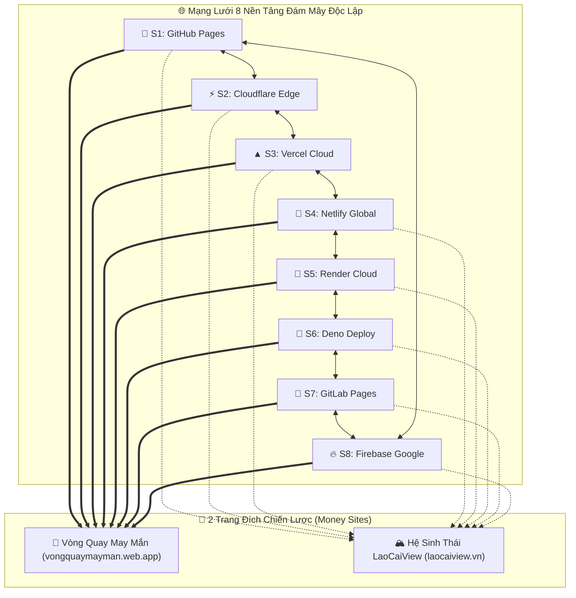

# ĐẶC TẢ KỸ THUẬT: HỆ THỐNG KẾT NỐI & QUẢN TRỊ 8 WEB VỆ TINH (SATELLITE MESH NETWORK HUB)
**Dự án:** Master Satellite Network Hub & Cross-Linking Matrix  
**Thư mục dự án:** `E:\web vệ tinh`  
**Phiên bản:** 1.0.0 Enterprise  
**Kiến trúc sư:** WebForge-AI  

---

## 1. MỤC TIÊU HỆ THỐNG (OBJECTIVES)
1. **Kết nối mạng lưới liên kết chéo (Cross-Linking Mesh Matrix):** Thiết lập mạng lưới liên kết DoFollow đa tầng giữa 8 hạ tầng vệ tinh đám mây độc lập, truyền dẫn sức mạnh SEO (Link Juice) an toàn, tự nhiên và bền vững.
2. **Hỗ trợ 2 trang đích chiến lược (Target Destinations):**
   - **Target A:** Cổng công cụ Mini-Game & Vòng Quay May Mắn Livestream: `https://vongquaymayman.web.app`
   - **Target B:** Hệ sinh thái Cổng thông tin & BĐS Du lịch Sa Pa: `https://laocaiview.vn`
3. **Trung tâm giám sát & điều hành (Centralized Monitoring Dashboard):** Giám sát trạng thái hoạt động (HTTP 200 OK), độ trễ DNS/CDN, chỉ số PageSpeed và kiểm tra tình trạng kết nối thời gian thực của 8 nền tảng vệ tinh.
4. **Bộ máy tự động hóa kết nối (Automation Mesh Connector):** Script tự động cập nhật và phân phối khối liên kết (Backlink Matrix Widget) tới tất cả các repo vệ tinh.

---

## 2. DANH SÁCH 8 NỀN TẢNG VỆ TINH ĐÁM MÂY (THE 8 CLOUD SATELLITES)

| STT | Tên Vệ Tinh & Chuyên Đề | Nền Tảng Đám Mây | Tên Miền / URL Hoạt Động | Thư Mục Cục Bộ Nguồn |
| :---: | :--- | :--- | :--- | :--- |
| **S1** | **Bất Động Sản & Review Sa Pa** | GitHub Pages *(DA 98)* | `https://nguyenhaithttsapa-rgb.github.io/batdongsan-sapa-review/` | `G:\Ve-Tinh-SEO-LaoCaiView\satellites\01-github-batdongsan-sapa` |
| **S2** | **Cẩm Nang Tour & Trải Nghiệm** | Cloudflare Pages/Workers *(DA 96)* | `https://sapa-tour-3n2d.laocaiview-vn.workers.dev/` | `G:\sapa-trekking-cloudflare` |
| **S3** | **Du Lịch Mùa Vàng Sa Pa** | Vercel Edge Cloud *(DA 92)* | `https://sapa-travel-experience.vercel.app/` | `G:\sapa-golden-season-vercel` |
| **S4** | **Ecolodge & Nghỉ Dưỡng Xanh** | Netlify Global CDN *(DA 94)* | `https://sapa-travel-experience.netlify.app/` | `G:\sapa-ecolodge-netlify` |
| **S5** | **Văn Hóa Bản Làng Sa Pa** | Render Cloud *(DA 85)* | `https://sapa-batdongsan-live.onrender.com/` | `G:\sapa-cultural-render` |
| **S6** | **Săn Mây & Điểm Check-in** | Deno Deploy *(DA 88)* | `https://sapa-photospots.deno.dev/` | `G:\sapa-photospots-deno` |
| **S7** | **Thị Trường Nhà Đất & Dự Án** | GitLab Pages *(DA 93)* | `https://nhadatlaocai-review.gitlab.io/` | `G:\Ve-Tinh-SEO-LaoCaiView\satellites\06-gitlab-nhadat-laocai` |
| **S8** | **Công Cụ Livestream & Mini-Game**| Firebase Hosting *(DA 96)* | `https://vongquaymayman.web.app/` | `E:\vong-quay-livestream` |

---

## 3. CƠ CHẾ KẾT NỐI MẠNG LƯỚI (MESH LINKING TOPOLOGY)


- **Vòng kết nối chéo khép kín (Circular & Full-Mesh Ring):** Mỗi site vệ tinh đều liên kết tự nhiên đến ít nhất 2-3 site vệ tinh khác trong mạng lưới (với anchor text đa dạng, không trùng lặp).
- **Đường dẫn mục tiêu kép (Dual-Core Funnel):** Toàn bộ 8 vệ tinh đồng loạt phân luồng người dùng và backlink về 2 trang đích cốt lõi với cấu trúc thẻ `rel="dofollow"` chuẩn SEO.

---

## 4. THIẾT KẾ CẤU TRÚC DỮ LIỆU & SCHEMA (DATA STRUCTURE)

```typescript
export interface SatelliteNode {
  id: string;               // s1 -> s8
  name: string;             // Tên hiển thị vệ tinh
  category: string;         // Chủ đề chuyên sâu
  cloudPlatform: 'GitHub Pages' | 'Cloudflare' | 'Vercel' | 'Netlify' | 'Render' | 'Deno Deploy' | 'GitLab Pages' | 'Firebase';
  domain: string;           // Tên miền gốc
  liveUrl: string;          // Đường link truy cập trực tiếp
  sourceLocalPath: string;  // Đường dẫn thư mục mã nguồn
  daScore: number;          // Domain Authority ước lượng
  status: 'online' | 'degraded' | 'offline';
  latencyMs: number;        // Độ trễ phản hồi
  lastChecked: string;      // Thời gian kiểm tra gần nhất
  connectedPeers: string[]; // Danh sách ID các vệ tinh liên kết chéo
  targetAnchors: {
    vongquay: string[];     // Danh sách từ khóa trỏ về vongquaymayman.web.app
    laocaiview: string[];   // Danh sách từ khóa trỏ về laocaiview.vn
  };
}

export interface NetworkHealthSummary {
  totalNodes: number;
  onlineCount: number;
  averageLatencyMs: number;
  totalBacklinksGenerated: number;
  meshIntegrityScore: number; // 0 - 100%
}
```

---

## 5. THIẾT KẾ GIAO DIỆN & CÔNG CỤ (UI/UX SPECIFICATION)
1. **Header Control Bar:**
   - Logo nhận diện thương hiệu `Satellite Mesh Master Hub`.
   - Nút `Kiểm tra kết nối Live (Ping All)` - chạy kiểm tra kết nối tới 8 server đám mây.
   - Nút `Đồng bộ Liên Kết (Sync Mesh)` - cập nhật widget liên kết chéo.
   - Bộ chọn chế độ xem: `Sơ đồ Mạng Lưới (Topology Graph)` | `Bảng Quản Trị (Data Table)` | `Bộ Sinh Mã Nhúng (Backlink Widget Generator)`.
2. **Thống Kê Tổng Quan (Metric Cards):**
   - Số vệ tinh hoạt động (8/8 Live 100%).
   - Tốc độ phản hồi trung bình CDN Edge (< 150ms).
   - Tổng số liên kết chéo hoạt động.
   - Trạng thái truyền lực SEO tới 2 Target Sites.
3. **Interactive Topology Mesh Graph (Canvas / SVG):**
   - Biểu đồ mạng tương tác trực quan hiển thị 8 nút vệ tinh xoay quanh 2 trang đích.
   - Đường truyền hạt sáng (animated particle flow) biểu diễn luồng backlink.
   - Click vào từng nút để xem thông số chi tiết, danh sách bài viết và thao tác mở link.
4. **Cross-Link Code Generator (Bộ Sinh Mã Liên Kết):**
   - Tự động xuất mã nhúng HTML/Tailwind CSS chuẩn để dán vào chân trang (Footer) hoặc thanh bên (Sidebar) của bất kỳ website nào.
   - Hỗ trợ xem trước trực quan (Live Preview).

---

## 6. TIÊU CHUẨN NGHIỆM THU (ACCEPTANCE CRITERIA)
- [x] Tạo file `docs/SPEC.md` chuẩn mực.
- [ ] Giao diện Dashboard chạy độc lập, 100% không lỗi, responsive mượt mà.
- [ ] Script kiểm tra `ping_satellites.py` chạy kiểm tra HTTP 200 thực tế tới cả 8 trang.
- [ ] Tạo file mã nhúng ma trận vệ tinh sẵn sàng kết nối.
